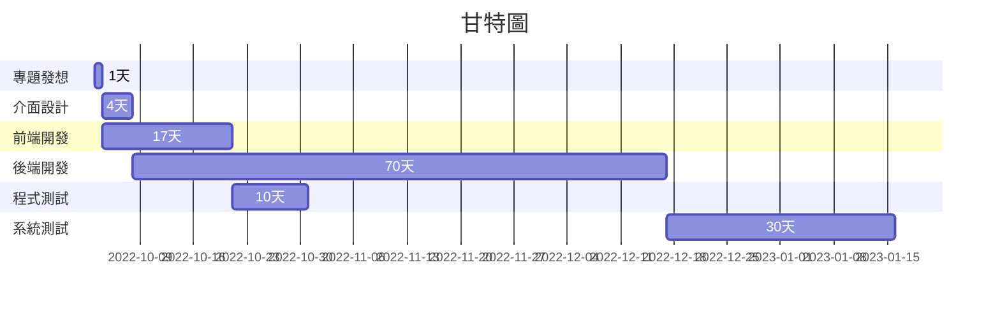

# 專題主題: Unity製作戰鬥飛機遊戲

|  職位  | 學號  | 姓名  | 工作內容 |
| :--------:  | :---------:  | :---------: | :---------: |
| 組長 | C109118143 | 洪義良 | 專題發想、介面設計 | 
| 組員 | C109118158 | 劉展誌 | 專題發想、程式開發(前端) |
| 組員 | C109118159 | 陳啟濠 | 專題發想、程式開發(後端) |
| 組員 | C109118160 | 黃祈順 | 專題發想、程式測試 |
| 組員 | C109118162 | 劉子輝 | 專題發想、系統測試 |

# 內容
有一台飛機會自動飛行和發射子彈，玩家可控制飛行左右前後，利用飛行移動攻擊外星怪物，
怪物會掉落金錢或升級裝備，升級裝備可以是飛機的子彈發生變化，變得更強力於通關，也有可能調出防護罩之類的。

# 甘特圖

# PERT/CPM

***
