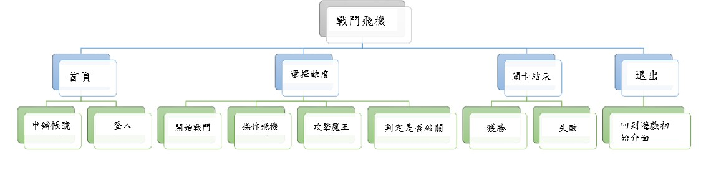
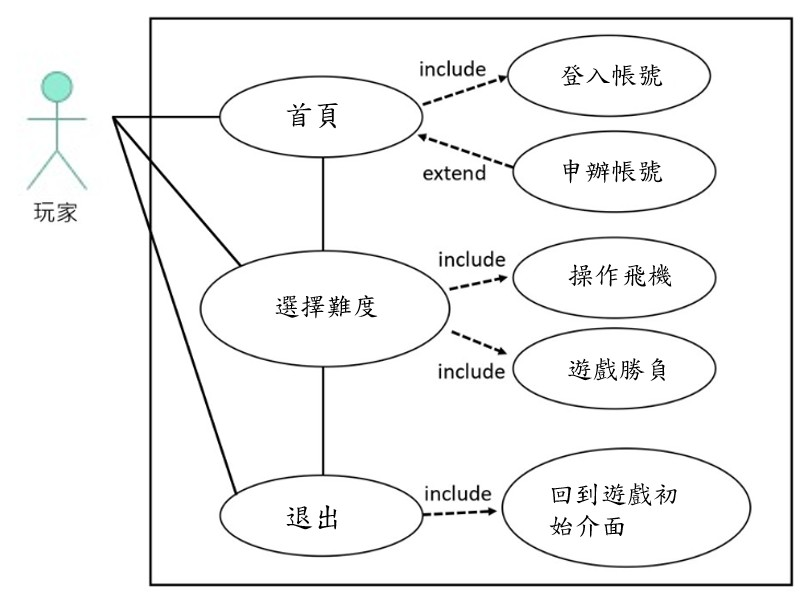
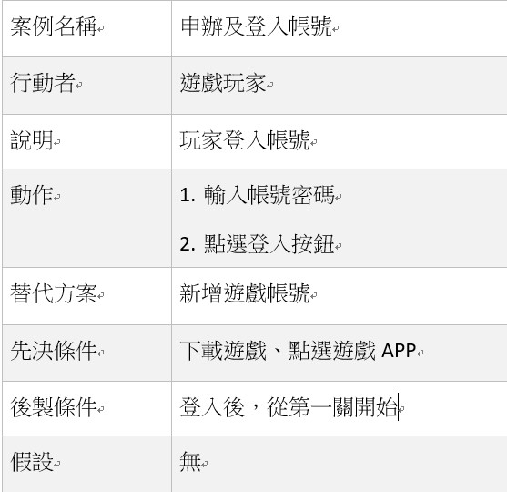
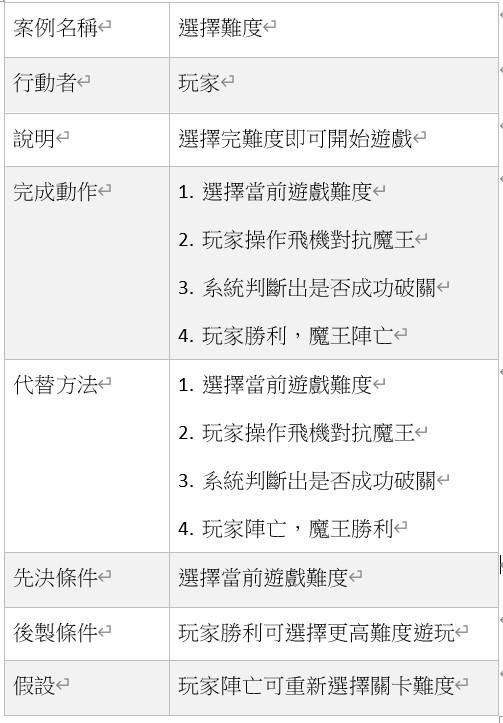
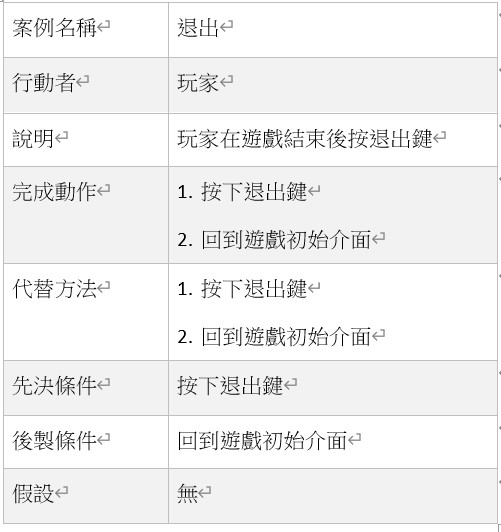

# 功能性需求及非功能性需求
功能性需求：

* 開始遊戲前可以選擇適用飛機種類
* 必須顯示敵對飛機的血條狀態及玩家飛機血條狀態
* 勝負結果是我方或者敵方BOSS陣亡
* 不管勝負遊戲結束後會更新進度及發放獎勵
* 能升級裝備，裝備也有分強度(灰->綠->藍->紫->橙->紅)

非功能性需求：

* 使用性 : 使用者操作簡易
* 反應時間 : 所有功能反應1秒內完成
* 維護性 : 定期維護遊戲

# FDD

# 需求分析
1. 玩家從遊戲初始介面登入帳號，即可開始遊戲
2. 玩家可以在遊戲初始介面創建遊戲帳號
3. 玩家可以選擇關卡難度，來選擇當下想要遊玩的難度
4. 魔王或是玩家的血量歸零之後，會顯示畫面勝利或失敗
5. 玩家在遊戲結束後可點擊退出來回到一開始的遊戲介面

# 使用案例

使用案例1說明

使用案例2說明

使用案例3說明

